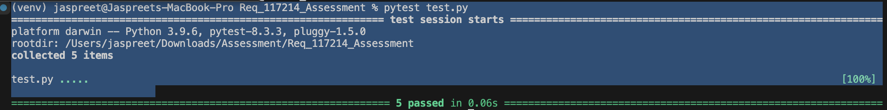

# Winter Supplement Engine 

## Requirements

- Python 3.7 or later
- MQTT Broker
- Flask
- Paho MQTT client library

## Installation

### 1. Clone the Repository

```bash
git clone https://github.com/yourusername/winter-supplement-engine.git
cd REQ_117214_Assessment
```

### 2. Create a Virtual Environment (Optional but recommended)

```bash
python3 -m venv venv
source venv/bin/activate 
```

### 3. Install Dependencies

```bash
pip install -r requirements.txt
```

The `requirements.txt` file should include the necessary libraries for this project.

```
Flask==2.3.0
paho-mqtt==1.6.1
alembic==1.14.0
blinker==1.9.0
click==8.1.7
Flask==3.1.0
Flask-Migrate==4.0.7
Flask-SQLAlchemy==3.1.1
gunicorn==23.0.0
importlib_metadata==8.5.0
itsdangerous==2.2.0
Jinja2==3.1.4
Mako==1.3.6
MarkupSafe==3.0.2
packaging==24.2
python-dotenv==1.0.1
SQLAlchemy==2.0.36
typing_extensions==4.12.2
Werkzeug==3.1.3
zipp==3.21.0

```

### 4. Configure the MQTT Broker

- Set the MQTT broker details (host, port, topics) in the `config.py` file.

`config.py`

### 5. Start the Flask Application - Local
To Update the Topic ID:
#### Step - 1
 Go to config.py 
#### Step - 2
 Update MQTT_TOPIC_ID = "0701e375-77b0-490b-a437-a214e24d3438" --- currently set as this '0701e375-77b0-490b-a437-a214e24d3438'.

   To start the Flask app, use the following command:

   ```bash
   python run.py
   ```
   or

   ```bash
   python3 run.py
   ```
   The application will start on `http://localhost:8000`

   Once you run the application locally, you will see in the console successfull connection as well as shows the id which it is subscribed to.
   

### 6. Start the Unit Tests - Local

   To start the unit tests.

   ```bash
   pytest test.py
   ```
   sucessfull output looks like this:

   

## Optional for now!
## Running in Production

1. Install Gunicorn:

   ```bash
   pip install gunicorn
   ```

2. Run the application with Gunicorn:

   ```bash
   gunicorn wsgi:app
   ```

